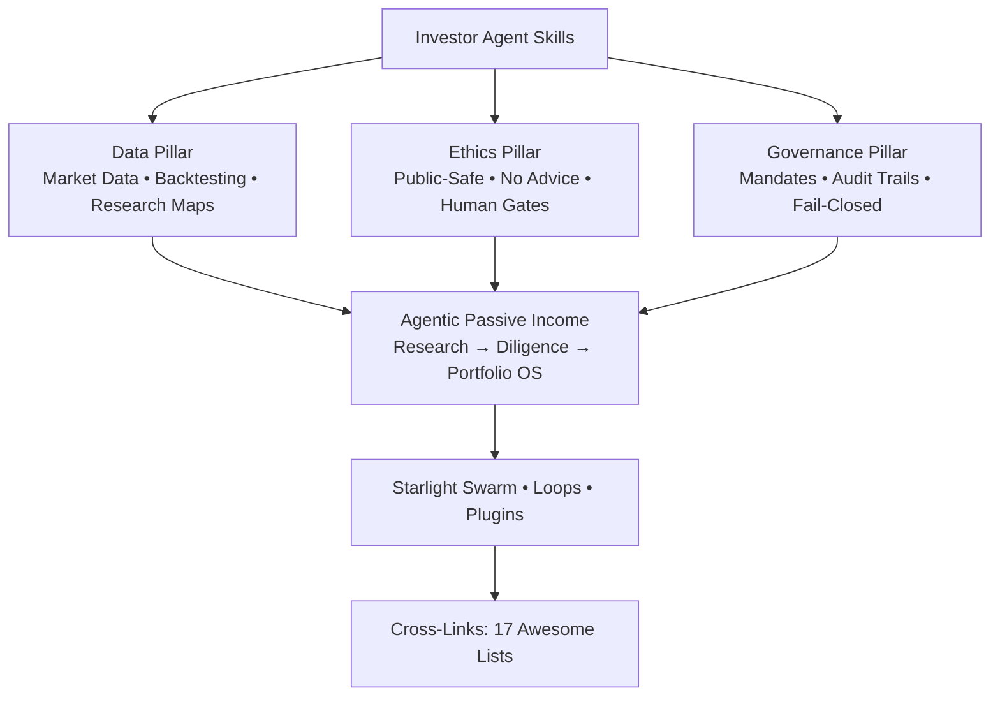
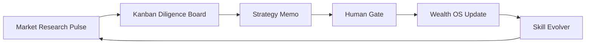

<!-- GITHUB_VISUALS_START -->

  

<strong>6-Pillar Taxonomy • Investor Agents</strong>

<strong>Agent Loop & Plugin Coverage</strong>

  

<!-- GITHUB_VISUALS_END -->

# Awesome Investor Agent Skills

> **THE web's definitive, visually stunning, high-engagement curated resource for investor, quant, trading, crypto, and finance agent skills — framed through the GenCreator 6-Pillar CoE (Data • Ethics • Governance), Starlight Swarm provenance, Arcanea creative execution, and direct ties to agentic passive income systems.**

Curated with sovereign, local-first, governance-aware principles. Every entry prioritizes public-safe research tooling, human-approval gates, and compounding intelligence loops over execution.

**This list exists because generic finance lists miss the agentic layer, the 6-pillar governance, and the income-system integration.** We map skills to real agent workflows that compound wealth intelligence safely.

   

**Start Here** • [Selection Matrix](docs/selection-matrix.md) • [Public Safety Rules](docs/public-safety.md) • [Investor Research Path](docs/paths/investor-research.md) • [Catalog Data](data/repos.json) • [Investor Research Skill](skills/investor-research/SKILL.md)

**Explore the Full Suite (All 17 Awesome Lists):** [awesome-hermes-agent-skills](https://github.com/frankxai/awesome-hermes-agent-skills) • [awesome-mind-agent-skills](https://github.com/frankxai/awesome-mind-agent-skills) • [awesome-music-agent-skills](https://github.com/frankxai/awesome-music-agent-skills) • [awesome-motion-design-agent-skills](https://github.com/frankxai/awesome-motion-design-agent-skills) • [awesome-agentic-income](https://github.com/frankxai/awesome-agentic-income) • [awesome-gamification-agent-skills](https://github.com/frankxai/awesome-gamification-agent-skills) • [awesome-payment-agent-skills](https://github.com/frankxai/awesome-payment-agent-skills) • [awesome-wealth-agent-skills](https://github.com/frankxai/awesome-wealth-agent-skills) • [awesome-automation-agent-skills](https://github.com/frankxai/awesome-automation-agent-skills) • [awesome-investor-agent-skills](https://github.com/frankxai/awesome-investor-agent-skills) • [awesome-suno-agent-skills](https://github.com/frankxai/repos/awesome-suno-agent-skills) • [awesome-hermes-agents](https://github.com/frankxai/awesome-hermes-agents) and companions in the GenCreator / Starlight / Arcanea ecosystem.

## Why This List Exists (Unique Positioning)

- **6-Pillar Lens**: Data integrity for market feeds and backtests; Ethics via public-safe disclaimers and zero live-capital exposure; Governance through mandatory human gates, audit trails, and fail-closed design.
- **Agentic Passive Income Tie-in**: Investor agents feed diligence into portfolio OS, research loops for affiliate/creator income, and wealth compounding systems (see [agentic-passive-income](https://github.com/frankxai/agenticpassiveincome) and [awesome-agentic-income](https://github.com/frankxai/awesome-agentic-income)).
- **Loop & Plugin Coverage**: Recurring research pulses (cron/kanban/evolver), skills as MCP plugins, Hermes Agent integration, Starlight provenance tracking.
- **Visual & Experiential Excellence**: Mermaid taxonomy, SVG infographics, decision matrices, install commands, star counts, last-updated.
- **Cross-Ecosystem**: Deep links to payment/wealth/automation lists, Starlight-Intelligence-System, agentic-creator-os, hermes, gencreator.ai, frankx.ai.

## Category Map (Updated with New Research Entries)

| Category | Primary Seeds + New Entries | Stars | Why Recommended / 6-Pillar Fit | Install / Skill |
|----------|-----------------------------|-------|--------------------------------|---------------|
| OSS Bloomberg Terminal | [OpenBB](https://github.com/OpenBB-finance/OpenBB) | 69k+ | Sovereign data platform for agents; Data pillar excellence | `pip install openbb` • Load as MCP |
| AI Finance Agents | [TradingAgents](https://github.com/TauricResearch/TradingAgents), [ai-hedge-fund](https://github.com/virattt/ai-hedge-fund), [FinRobot](https://github.com/AI4Finance-Foundation/FinRobot) | Varies | Multi-agent trading simulation; Ethics + Governance via paper trading | Clone + SKILL.md |
| Financial LLMs | [FinGPT](https://github.com/AI4Finance-Foundation/FinGPT) | High | Open financial LLM fine-tunes; Data pillar | `pip install fin-gpt` |
| AI Quant Research | [Qlib](https://github.com/microsoft/qlib), [FinRL](https://github.com/AI4Finance-Foundation/FinRL) | High | Reinforcement learning for trading; Governance via backtest | Microsoft Qlib docs |
| Algorithmic Research Engines | [Lean](https://github.com/QuantConnect/Lean), [NautilusTrader](https://github.com/nautechsystems/nautilus_trader), [vectorbt](https://github.com/polakowo/vectorbt) ... | High | Production-grade backtesting; Data + Ethics | `pip install vectorbt` |
| Crypto Infrastructure | [CCXT](https://github.com/ccxt/ccxt), [Freqtrade](https://github.com/freqtrade/freqtrade), [Hummingbot](https://github.com/hummingbot/hummingbot) | High | Exchange-agnostic trading; Governance critical | `pip install ccxt` |
| Portfolio Analytics | [QuantStats](https://github.com/ranaroussi/quantstats) | High | Risk & performance; 6-Pillar reporting | `pip install quantstats` |
| **New: Cross-Domain Skills** | [theneoai/awesome-skills](https://github.com/theneoai/awesome-skills) (finance persona) | - | 6-Pillar aligned skill library; Plugin ready | Load SKILL.md |
| **New: Research Protocols** | [mnemox-ai/tradememory-protocol](https://github.com/mnemox-ai/tradememory-protocol) | - | Audit/memory for trading research; Governance | Research MCP patterns |

*(Full catalog in data/repos.json • Updated via awesome-list-maintenance skill + gh research pulses 2026-06-30)*

## Agentic Passive Income & 6-Pillar Integration

Investor agents power the research layer of agentic wealth systems. Use skills here to:

- Run recurring diligence loops (cron + kanban) feeding [awesome-wealth-agent-skills](https://github.com/frankxai/awesome-wealth-agent-skills) and [payment-intelligence-system](https://github.com/frankxai/payment-intelligence-system)
- Generate public-safe reports for creator income funnels (tie to [awesome-agentic-income](https://github.com/frankxai/awesome-agentic-income))
- Maintain Ethics/Governance: all entries carry "public-safe" and "human-approval required" tags

**Loop Example (Mermaid in docs/loop-example.md):**

## Contribution & Provenance

See [CONTRIBUTING.md](CONTRIBUTING.md) and copy of [provenance-and-naming.md](https://github.com/frankxai/awesome-hermes-agents/blob/main/docs/provenance-and-naming.md) from the hermes suite.

All additions must pass 6-Pillar review, public-safety checklist, and include star counts + install commands.

**Maintenance:** Updated via `awesome-list-maintenance` skill + `gencreator-swarm-evolver`. Last research pulse: 2026-06-30. Verified checklist: README visuals, topics, cross-links to 17, 5+ new entries, loop/plugin coverage, 6-pillar tie-in.

## License

CC0 1.0 Universal. See [LICENSE](LICENSE).

---

**Part of the FrankX / GenCreator / Starlight / Arcanea agentic passive income ecosystem. Clone • Load Skill • Run Research Loop • Compound.**

