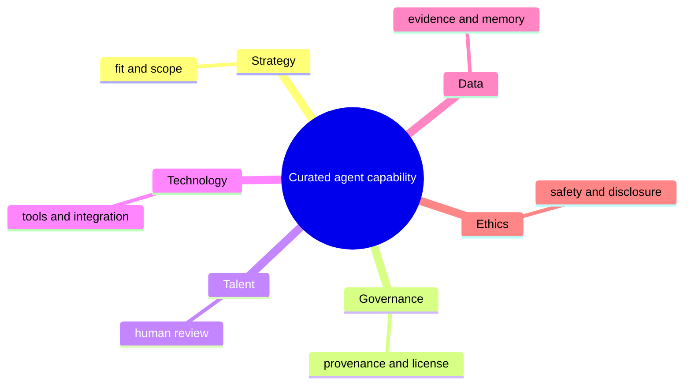

# Awesome Investor Agent Skills

  

> Web-first research and analysis tools for investor workflows: educational research and simulation only, never personalized investment advice.

This is an independent, **web-first** catalog. It remains useful if every FrankX link is removed: third-party primary sources lead, while companion lists appear only at the end.

## Start here

Use public data and reproducible notebooks; separate collection, analysis, backtesting, and any regulated or execution-adjacent action.

<!-- earned-skill-index:2026-08-30 -->

## Earned agent skills (start here)

Operators get leverage from **about 5–7 named workflows**, not bulk dumps. Hub: [https://github.com/frankxai/awesome-hermes-agent-skills](https://github.com/frankxai/awesome-hermes-agent-skills) · [earned index](https://github.com/frankxai/awesome-hermes-agent-skills/blob/main/docs/EARNED-SKILLS.md) · [safety gate](https://github.com/frankxai/awesome-hermes-agent-skills/blob/main/docs/QUALITY-AND-SAFETY.md).

**Investor research skills (not advice)**

| Pack | Job |
| --- | --- |
| [OpenBB-finance/OpenBB](https://github.com/OpenBB-finance/OpenBB) | Public-market research platform |
| [microsoft/qlib](https://github.com/microsoft/qlib) | Simulation and research — not live trading |
| [longbridge/skills](https://github.com/longbridge/skills) | Multi-region market skills |
| [longsizhuo/openInvest](https://github.com/longsizhuo/openInvest) | Investment research patterns |
| [NVIDIA/SkillSpector](https://github.com/NVIDIA/SkillSpector) | Scan before install |

Scan with [NVIDIA SkillSpector](https://github.com/NVIDIA/SkillSpector) before a live profile. Do not install unsigned ZIP/S3 skill blobs or OpenClaw mass dumps.

## Peer directories and standards

[OpenBB-finance/OpenBB](https://github.com/OpenBB-finance/OpenBB) · [microsoft/qlib](https://github.com/microsoft/qlib)

## Curated catalog

| Project | Pulse snapshot | Why it is here |
| --- | --- | --- |
| [OpenBB](https://github.com/OpenBB-finance/OpenBB) | NOASSERTION · 71,296★ | Open data platform for analysts and AI agents. |
| [Qlib](https://github.com/microsoft/qlib) | MIT · 46,947★ | AI-oriented quantitative research. |
| [QuantStats](https://github.com/ranaroussi/quantstats) | Apache-2.0 · 7,511★ | Portfolio analytics for quants. |
| [LEAN](https://github.com/QuantConnect/Lean) | Apache-2.0 · 21,025★ | Execution-adjacent engine; education/backtesting only. |
| [cvxportfolio](https://github.com/cvxgrp/cvxportfolio) | GPL-3.0 · 1,244★ | Portfolio optimization/backtesting. |
| [OpenAI Agents SDK](https://github.com/openai/openai-agents-python) | MIT · 28,345★ | Bounded research assistants with approval gates. |
| [TradingAgents](https://github.com/TauricResearch/TradingAgents) | Apache-2.0 · 95,714★ | Multi-agent financial-research framework; execution-adjacent, so keep use to public data and simulation. |

## 6-Pillar curation lens

```mermaid
mindmap
  root((Curated agent capability))
    Strategy
      fit and scope
    Governance
      provenance and license
    Talent
      human review
    Technology
      tools and integration
    Data
      evidence and memory
    Ethics
      safety and disclosure
```

This lens is editorial, not an endorsement or a claim that a project satisfies every pillar.

## Explore the Full FrankX Awesome Ecosystem (optional)

Companion catalogs are optional; the third-party projects above are this list's primary value.

- [awesome-jarvis](https://github.com/frankxai/awesome-jarvis) · [awesome-hermes-agents](https://github.com/frankxai/awesome-hermes-agents) · [awesome-manifestation-skills](https://github.com/frankxai/awesome-manifestation-skills) · [awesome-ai-coe](https://github.com/frankxai/awesome-ai-coe)
- [awesome-agentic-income](https://github.com/frankxai/awesome-agentic-income) · [awesome-investor-agent-skills](https://github.com/frankxai/awesome-investor-agent-skills) · [awesome-design-agent-skills](https://github.com/frankxai/awesome-design-agent-skills) · [awesome-agent-operating-systems](https://github.com/frankxai/awesome-agent-operating-systems)
- [awesome-music-agent-skills](https://github.com/frankxai/awesome-music-agent-skills) · [awesome-hermes-agent-skills](https://github.com/frankxai/awesome-hermes-agent-skills) · [awesome-gamification-agent-skills](https://github.com/frankxai/awesome-gamification-agent-skills) · [awesome-wealth-agent-skills](https://github.com/frankxai/awesome-wealth-agent-skills)
- [awesome-mind-agent-skills](https://github.com/frankxai/awesome-mind-agent-skills) · [awesome-cosmos-ai-agents](https://github.com/frankxai/awesome-cosmos-ai-agents) · [awesome-automation-agent-skills](https://github.com/frankxai/awesome-automation-agent-skills) · [awesome-payment-agent-skills](https://github.com/frankxai/awesome-payment-agent-skills) · [awesome-motion-design-agent-skills](https://github.com/frankxai/awesome-motion-design-agent-skills)

## Contribution standard

Open a PR with a primary URL, one-sentence distinct value, current maintenance evidence, license posture, and relevant safety/deployment caveat. Do not submit affiliate links, private workflow exports, unverified claims, or a product pitch in place of a useful third-party resource.

## Research method

This monthly pulse queried selected GitHub repository metadata on **2026-08-05** for identity, approximate stars, archived state, activity, and license posture. Earlier rows retain their prior dated snapshots where they were not re-fetched. `NOASSERTION` means GitHub did not return a standard SPDX identifier; review the repository license before adoption. Counts are dated discovery signals, not rankings. Nothing here is financial, legal, medical, or safety advice.

Maintained as independent, web-first curation by FrankX. Last research pulse: **2026-08-05**.
