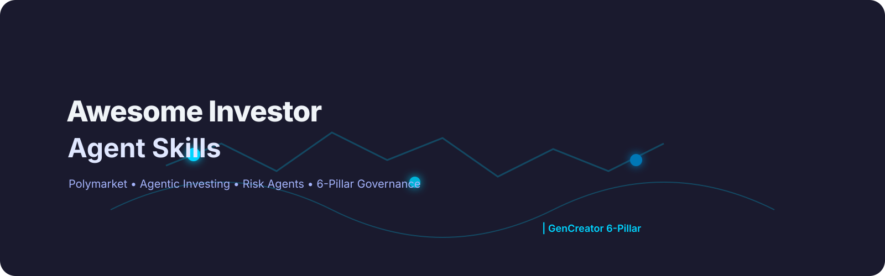
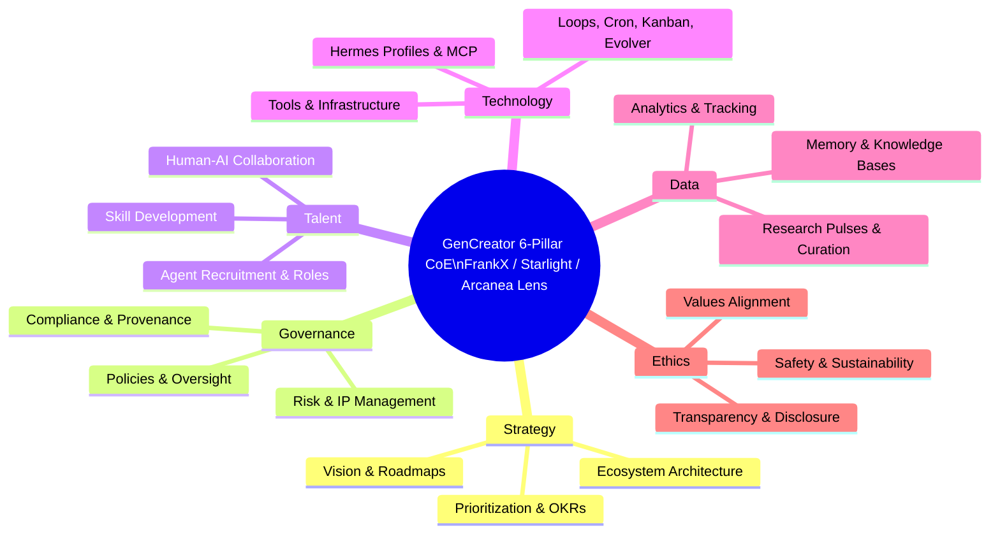

  

<h1 align="center">Awesome Investor Agent Skills</h1>

  <strong>Curated through the GenCreator 6-Pillar CoE lens • Starlight Swarm • Arcanea Creative Execution • Agentic Passive Income Systems</strong>

  <a href="#contents">Contents</a> ·
  <a href="#6-pillar-mapping">6-Pillar Mapping</a> ·
  <a href="#explore-the-full-frankx-awesome-ecosystem-17-lists">Full Ecosystem (17)</a> ·
  <a href="#contributing">Contribute</a>

> **THE definitive curated resource for investor-agent-skills** — Quant research, trading simulation, Polymarket agents, risk governance, agentic investing tools. Research catalog only (no live advice or recommendations).

## Why This List Exists
Investor agents tie into wealth pillar and agentic passive income. Focus on simulation, research, 6-Pillar risk/ethics. Public boundary enforced per AGENTS.md.

## Contents
- [Top Picks](#top-picks)
- [Quant Research & Simulation](#quant-research--simulation)
- [Market & Prediction Agents](#market--prediction-agents)
- [MCP & Agent Skills](#mcp--agent-skills)
- [Agentic Passive Income & Loops](#agentic-passive-income--loops)
- [6-Pillar Mapping](#6-pillar-mapping)
- [Explore the Full FrankX Awesome Ecosystem (17+ Lists)](#explore-the-full-frankx-awesome-ecosystem-17-lists)
- [Contributing](#contributing)

## Top Picks
| Category | Recommended | 6-Pillar Fit |
|----------|-------------|--------------|
| Prediction | Polymarket agents | Governance + Data |
| Simulation | Backtesting agents | Technology + Ethics |
| Research | Public quant tools | Data pillar |

## Quant Research & Simulation
- Public APIs for market data, backtesting frameworks (research/simulation only).
- Integration with polymarket skill patterns.
- Cross-reference with wealth-agent-skills and gamification for simulated trading games.

## Market & Prediction Agents
- **[Polymarket](https://polymarket.com/)** – Prediction market platform; agents for market analysis and resolution research (public data only).
- LLM agents for news sentiment, on-chain monitoring (sanitized examples).

## MCP & Agent Skills
- gstack investor/quant skills.
- Load skill_view(name='agentic-passive-income') for income angle.

## Agentic Passive Income & Loops
- Research agents that compound knowledge into publishable insights or tool sales.
- Simulated portfolio agents for education.

## 6-Pillar Mapping

```mermaid
mindmap
  root((GenCreator 6-Pillar CoE\nFrankX / Starlight / Arcanea Lens))
    Strategy
      Vision & Roadmaps
      Prioritization & OKRs
      Ecosystem Architecture
    Governance
      Policies & Oversight
      Compliance & Provenance
      Risk & IP Management
    Talent
      Agent Recruitment & Roles
      Human-AI Collaboration
      Skill Development
    Technology
      Hermes Profiles & MCP
      Tools & Infrastructure
      Loops, Cron, Kanban, Evolver
    Data
      Memory & Knowledge Bases
      Research Pulses & Curation
      Analytics & Tracking
    Ethics
      Values Alignment
      Transparency & Disclosure
      Safety & Sustainability
```

**Investor focus**: Governance (risk, compliance), Ethics (no advice, transparency), Data (analytics), Technology (MCP, sims).

## Explore the Full FrankX Awesome Ecosystem (17+ Lists)
Curated through the GenCreator 6-Pillar CoE lens • Starlight Swarm • Arcanea Creative Execution • Agentic Passive Income Systems

- [awesome-jarvis](https://github.com/frankxai/awesome-jarvis)
- [awesome-manifestation-skills](https://github.com/frankxai/awesome-manifestation-skills)
- [awesome-agentic-income](https://github.com/frankxai/awesome-agentic-income)
- [awesome-hermes-agents](https://github.com/frankxai/awesome-hermes-agents)
- [awesome-ai-coe](https://github.com/frankxai/awesome-ai-coe)
- [awesome-design-agent-skills](https://github.com/frankxai/awesome-design-agent-skills)
- [awesome-music-agent-skills](https://github.com/frankxai/awesome-music-agent-skills)
- [awesome-agent-operating-systems](https://github.com/frankxai/awesome-agent-operating-systems)
- [awesome-hermes-agent-skills](https://github.com/frankxai/awesome-hermes-agent-skills)
- [awesome-wealth-agent-skills](https://github.com/frankxai/awesome-wealth-agent-skills)
- [awesome-gamification-agent-skills](https://github.com/frankxai/awesome-gamification-agent-skills)
- [awesome-investor-agent-skills](https://github.com/frankxai/awesome-investor-agent-skills) ← You are here
- [awesome-automation-agent-skills](https://github.com/frankxai/awesome-automation-agent-skills)
- [awesome-cosmos-ai-agents](https://github.com/frankxai/awesome-cosmos-ai-agents)
- [awesome-mind-agent-skills](https://github.com/frankxai/awesome-mind-agent-skills)
- [awesome-payment-agent-skills](https://github.com/frankxai/awesome-payment-agent-skills)
- [awesome-motion-design-agent-skills](https://github.com/frankxai/awesome-motion-design-agent-skills)

## Contributing
Follow AGENTS.md public boundary strictly. No financial, investment, or trading advice. Read CONTRIBUTING.md and provenance rules. Use .github/ISSUE_TEMPLATE/. Add 6-Pillar Fit and sources only.

**Maintenance**: Updated via awesome-list-maintenance skill + gencreator-swarm-evolver. Last research pulse: 2026-07-01

*Elevated with patched template: mermaid 6-pillar, 17-list cross links, hero.svg, .github/ standards, gh topics/description. Verified with gh/git.*
